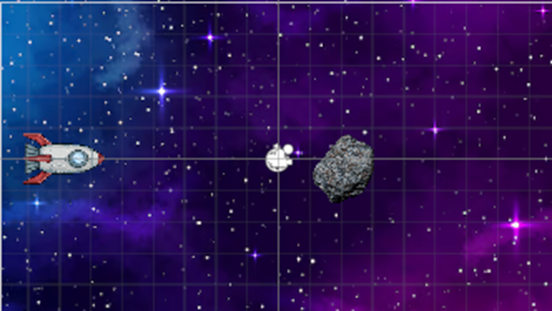
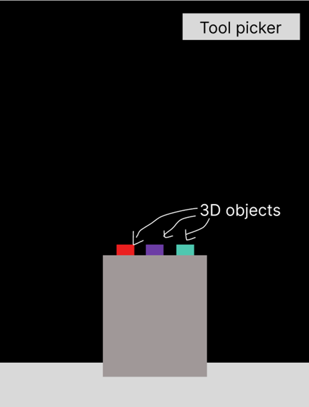
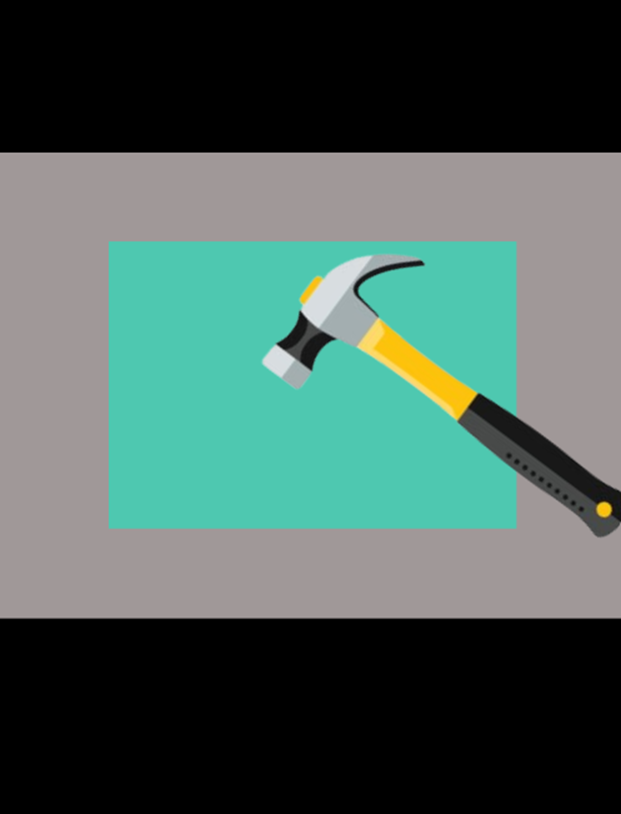

# Weekly Class Journal

## Make a Thing (01.15.26 - 01.22.26)

Once I saw the assignment, I started to think over and over again "Make a Thing...what does it mean and what can I make?"

The first thing that came to mind was a smaller scale and doable game since I only had a week timeframe to complete it.

I decided to use Bitsy for my project since it looked easy to use and simple. Originally I wanted to make a game/experience about making different kind of eggs. It would kind of be a continuation of my [VarJam](https://jbodika.github.io/CART-253/Assignments/VariationJam/) game from CART 253, it was a smoothie making game. Although I realized that would not be feasible with bitsy due to its lack of flexibility and its countless limitations for example with colors. I wanted to add more than one colour to a sprite or an item, but the program wouldn't let me. So I decided to adapt.

I tried just started playing around with the different features bitsy offers, and i enjoyed how freely I could move the character. the idea of a riddle game came to me since I wanted to play around with free movement and make it gamified. I've made pixel art before but I wanted to keep it simple and short so I made the graphics alphabet letters. I allow the user to read a riddle and move throughout the different spaces to solve the riddles. All of the riddles are about alphabet letters so it makes it easier.

I believe I could expand on this project by adding more elements to the environment to allow it to be more polished and look better but I am happy of what I produced in such little time. This assignment allowed me to explore different small scale game building tools and I'm eager to try the rest of them in my free time.

## Exploration Prototype 1 (01.22.26 - 01.29.26)

This week, I struggled a lot with the exploration. The content we learned for C# wasn't difficult because I'm very familiar with C#, although trying to understand how to use Unity was challenging since I wasn't able to follow along with last week's tutorial. 

I explored the CatchAMall prototype, I watched YouTube tutorials and played around with settings to test out certain elements and features. For example, I didn't understand why the building sprites weren't dropping, so I was clicking on different tools until I realized it was because I didn't add the Rigid Body 2D component to those sprites.

I guess I just didn't understand the global idea of what needed to be done with the sprites/components, and I assumed that things were intuitive and easy to use. (I was very wrong) 

I intend to practice with more Unity prototypes so I can understand what's going on and be more prepared for the upcoming projects we have in this course. 

## Exploration Prototype II (01.29.26 - 02.05.26)
For this week I wanted to try to follow a tutorial that was talking about the same topics we saw in class last week. I found a tutorial that uses physics and plays with sound. The concept of the project was fairly simple to make but I encountered many small issues. 

The tutorial had nice features like wing propelling, engine noises and camera movement 
When I first tried to download and open the assets from unity’s website it wasn’t working. I would add them to my library, but when I wanted to open them, it would just show me the Unity Hub project menu. ( I thought it was a PC issue, so I switched computers, but it ended being a user error on my part. )

 I decided to search on google and I found a solution through a reddit forum. The unity developers “hid” the menu to grab assets under the window settings. It was very confusing to get to my assets, and I wish it would’ve been more intuitive but at least now I know where I can get them in the future. 

My next issue was that the object was missing its texture/material, so I looked up a tutorial on how I can make it show up. I had to play around with the settings in unity to make sure they’d show up. 

A constant issue I would experience were the warnings/errors for the code I was using. Since this tutorial is out of date. I got a lot of errors/warnings in the console for obsolete/deprecated code. 

I enjoyed learning about the different components and ways to tweak an object to simulate “weight” for example the plane needed to weigh 400 lbs so I had to increase the mass attribute of the rigidbody to control the heaviness of the object. 

I think for future projects I would try to use newer tutorials or attempt to substitute some features for more “recent” methods of Unity. I think that would save me from a lot of headaches. 

I am happy with the end result of this exploration I would like to expand on the features possibly by adding a second plane? Maybe a nice scenery? Adjusting the speed of the plane based on how long and the amount of pressure on the keys? There’s a lot of features that can be added to expand on this. 

## Exploration Prototype III (02.05.26 - 02.12.26)
 

In this week's exploration I followed a tutorial on how to spawn different prefab objects. this tutorial was very clear and informational. I did experience a few errors due to following an older tutorial. I made a spaceship that moves around based on where you press on the screen. I had a few errors because I didn’t properly instantiate some variables with all the correct parameters, so I was.
I think the experience could be enhanced by having a moving background and a joystick or a visual indicator of how you’re moving the ship because I would often get confused of the direction in which the ship is coming from. 

I spent a lot of time not understanding why I couldn’t spawn multiple objects, until I checked out the camera projection. In the tutorial the person had it in perspective view and I have it orthographic view so I wasn’t able to see the different asteroids spawning in since they were coming out from a different axis. This prototype is a great starting point but there’s a lot of ways that this can be enhanced and improved to be a full project. 
Maybe there’s damage? Or obstacles than asteroids? Maybe power ups by hitting random objects from earth. 

I added collision detection to help immerse yourself in the experience. So the asteroids wont run through the ship and It adds.

## Exploration Prototype IIII (02.12.26 - 02.19.26)
For this week I wanted to try to follow a tutorial that was talking about the same topics we saw in class last week. I found a tutorial that uses physics and plays with sound. The concept of the project was fairly simple to make but I encountered many small issues.

The tutorial had nice features like wing propelling, engine noises and camera movement When I first tried to download and open the assets from unity’s website it wasn’t working. I would add them to my library, but when I wanted to open them, it would just show me the Unity Hub project menu. ( I thought it was a PC issue, so I switched computers, but it ended being a user error on my part. )

I decided to search on google and I found a solution through a reddit forum. The unity developers “hid” the menu to grab assets under the window settings. It was very confusing to get to my assets, and I wish it would’ve been more intuitive but at least now I know where I can get them in the future.

My next issue was that the object was missing its texture/material, so I looked up a tutorial on how I can make it show up. I had to play around with the settings in unity to make sure they’d show up.

A constant issue I would experience were the warnings/errors for the code I was using. Since this tutorial is out of date. I got a lot of errors/warnings in the console for obsolete/deprecated code.

I enjoyed learning about the different components and ways to tweak an object to simulate “weight” for example the plane needed to weigh 400 lbs so I had to increase the mass attribute of the rigidbody to control the heaviness of the object.

I think for future projects I would try to use newer tutorials or attempt to substitute some features for more “recent” methods of Unity. I think that would save me from a lot of headaches.

I am happy with the end result of this exploration I would like to expand on the features possibly by adding a second plane. Maybe a nice scenery? Adjusting the speed of the plane based on how long and the amount of pressure on the keys? There’s a lot of features that can be added to expand on this.

## Iterative Prototype 1 - Conceptualizing (02.19.26 - 02.26.26)

I first started off by brainstorming ideas for 5 minutes, I set up a timer and started typing. The ideas weren’t flowing to me naturally and I just kept overthinking. When the timer was done, I looked back at all my choices, and I realized that I had a couple promising  ones. 
1.	Dog walking
2.	Moving trucks
3.	Pixel Outfit Picker
4.	Song maker
5.	Mini guitar playing game
6.	Jewelry maker
7.	Cleaning/sorting items in a space
8.	Insomnia escape
9.	Popper/Breaker
10.	Escape room 
11.	Quest??

### My top 3.5
1.	Pixel Outfit Picker
 
Inspired by the spinning wheel in clueless where the character is browsing through different clothes in her closet to find the outfit she’ll wear.  I would probably build the assets on my own with a pixel art program (pixilart) and the interface would be done in unity. 

2.	Jewlery maker
Helper to set up for making jewelry, I like to make jewelry sometimes and if I had a program where I could visualize what I want to make before buying the assets I think it would help me make a decision faster!  This game would have different jewlery assets in 2D, you'd be able to select what kind of style of jewlery you would want to make and pick and the items would appear next to eachoteher? 

3.	Breaker
Inspired by demolition rooms where people break things, this game would give you different objects (3D objects) that would break based on how they are thrown and it would make sounds based on the kind of item. 

4.	Escape room
There’s a mystery you only have 15 mins-ish to solve it and escape. Since it won’t be too long I would probably have 3-4 different milestones that the user has to go through. I’m not sure how I would create the different mini scenarios and how I could build it but I do like the concept of escaping. 

I chose to make the look and feel prototype images based on the Demolition room game.

