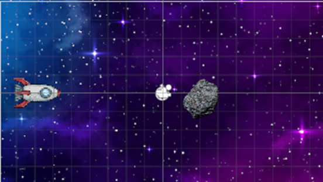
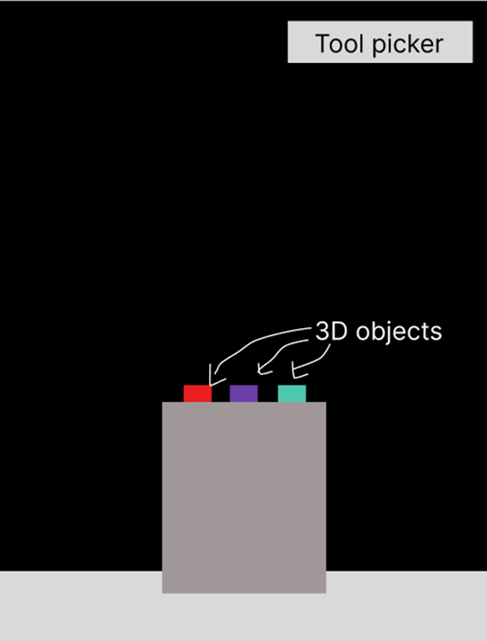
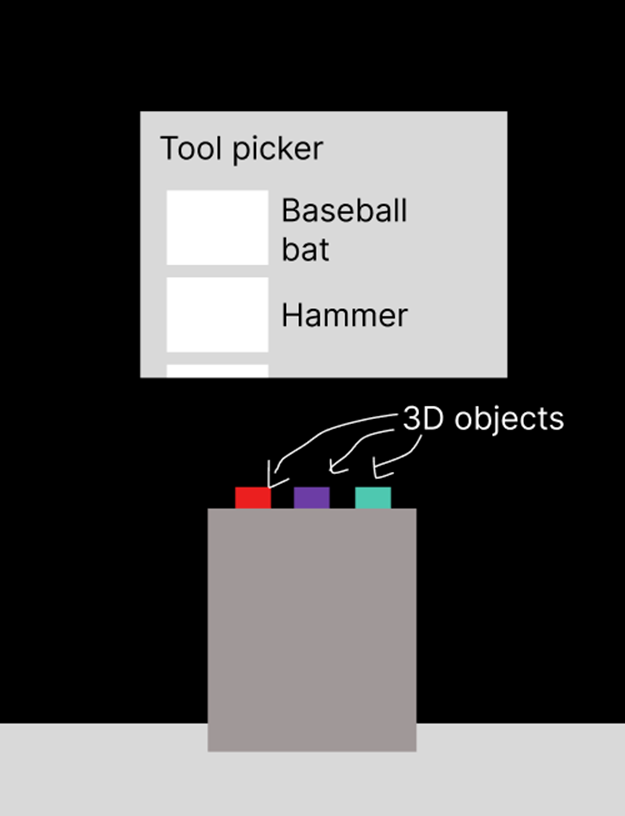
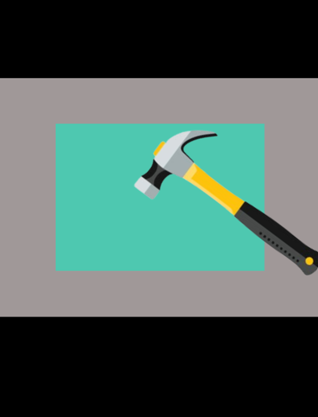
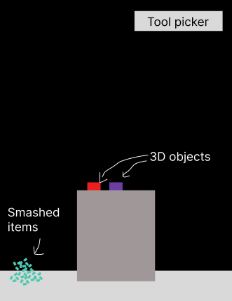
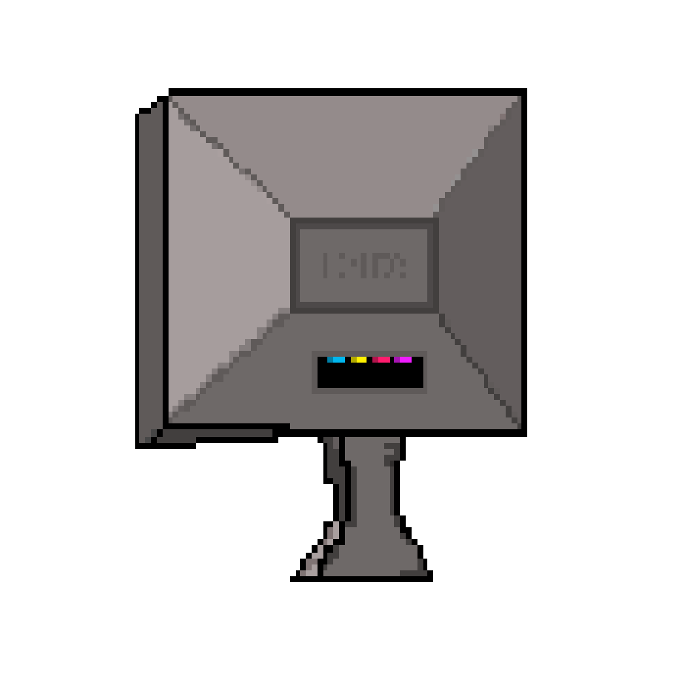
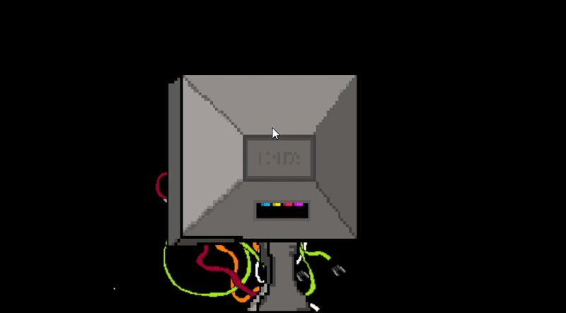
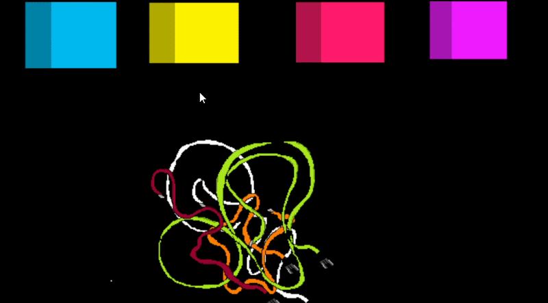

# Weekly Class Journal

## Make a Thing (01.15.26 - 01.22.26)

Once I saw the assignment, I started to think over and over again "Make a Thing...what does it mean and what can I make?"

The first thing that came to mind was a smaller scale and doable game since I only had a week timeframe to complete it.

I decided to use Bitsy for my project since it looked easy to use and simple. Originally I wanted to make a game/experience about making different kind of eggs. It would kind of be a continuation of my [VarJam](https://jbodika.github.io/CART-253/Assignments/VariationJam/) game from CART 253, it was a smoothie making game. Although I realized that would not be feasible with bitsy due to its lack of flexibility and its countless limitations for example with colors. I wanted to add more than one colour to a sprite or an item, but the program wouldn't let me. So I decided to adapt.

I tried just started playing around with the different features bitsy offers, and i enjoyed how freely I could move the character. the idea of a riddle game came to me since I wanted to play around with free movement and make it gamified. I've made pixel art before but I wanted to keep it simple and short so I made the graphics alphabet letters. I allow the user to read a riddle and move throughout the different spaces to solve the riddles. All of the riddles are about alphabet letters so it makes it easier.

I believe I could expand on this project by adding more elements to the environment to allow it to be more polished and look better but I am happy of what I produced in such little time. This assignment allowed me to explore different small scale game building tools and I'm eager to try the rest of them in my free time.

## Exploration Prototype 1 (01.22.26 - 01.29.26)


This week, I struggled a lot with the exploration. The content we learned for C# wasn't difficult because I'm very familiar with C#, although trying to understand how to use Unity was challenging since I wasn't able to follow along with last week's tutorial. 


I explored the CatchAMall prototype, I watched YouTube tutorials and played around with settings to test out certain elements and features. For example, I didn't understand why the building sprites weren't dropping, so I was clicking on different tools until I realized it was because I didn't add the Rigid Body 2D component to those sprites.


I guess I just didn't understand the global idea of what needed to be done with the sprites/components, and I assumed that things were intuitive and easy to use. (I was very wrong) 


I intend to practice with more Unity prototypes so I can understand what's going on and be more prepared for the upcoming projects we have in this course. 


## Exploration Prototype II (01.29.26 - 02.05.26)
For this week I wanted to try to follow a tutorial that was talking about the same topics we saw in class last week. I found a tutorial that uses physics and plays with sound. The concept of the project was fairly simple to make but I encountered many small issues. 

The tutorial had nice features like wing propelling, engine noises and camera movement 
When I first tried to download and open the assets from unity’s website it wasn’t working. I would add them to my library, but when I wanted to open them, it would just show me the Unity Hub project menu. ( I thought it was a PC issue, so I switched computers, but it ended being a user error on my part. )

 I decided to search on google and I found a solution through a reddit forum. The unity developers “hid” the menu to grab assets under the window settings. It was very confusing to get to my assets, and I wish it would’ve been more intuitive but at least now I know where I can get them in the future. 

My next issue was that the object was missing its texture/material, so I looked up a tutorial on how I can make it show up. I had to play around with the settings in unity to make sure they’d show up. 

A constant issue I would experience were the warnings/errors for the code I was using. Since this tutorial is out of date. I got a lot of errors/warnings in the console for obsolete/deprecated code. 

I enjoyed learning about the different components and ways to tweak an object to simulate “weight” for example the plane needed to weigh 400 lbs so I had to increase the mass attribute of the rigidbody to control the heaviness of the object. 

I think for future projects I would try to use newer tutorials or attempt to substitute some features for more “recent” methods of Unity. I think that would save me from a lot of headaches. 

I am happy with the end result of this exploration I would like to expand on the features possibly by adding a second plane? Maybe a nice scenery? Adjusting the speed of the plane based on how long and the amount of pressure on the keys? There’s a lot of features that can be added to expand on this. 


## Exploration Prototype III (02.05.26 - 02.12.26)
 

In this week's exploration I followed a tutorial on how to spawn different prefab objects. this tutorial was very clear and informational. I did experience a few errors due to following an older tutorial. I made a spaceship that moves around based on where you press on the screen. I had a few errors because I didn’t properly instantiate some variables with all the correct parameters, so I was.
I think the experience could be enhanced by having a moving background and a joystick or a visual indicator of how you’re moving the ship because I would often get confused of the direction in which the ship is coming from. 

I spent a lot of time not understanding why I couldn’t spawn multiple objects, until I checked out the camera projection. In the tutorial the person had it in perspective view and I have it orthographic view so I wasn’t able to see the different asteroids spawning in since they were coming out from a different axis. This prototype is a great starting point but there’s a lot of ways that this can be enhanced and improved to be a full project. 
Maybe there’s damage? Or obstacles than asteroids? Maybe power ups by hitting random objects from earth. 


I added collision detection to help immerse yourself in the experience. So the asteroids wont run through the ship and It adds.


## Exploration Prototype IIII (02.12.26 - 02.19.26)
For this week I wanted to try to follow a tutorial that was talking about the same topics we saw in class last week. I found a tutorial that uses physics and plays with sound. The concept of the project was fairly simple to make but I encountered many small issues.

The tutorial had nice features like wing propelling, engine noises and camera movement When I first tried to download and open the assets from unity’s website it wasn’t working. I would add them to my library, but when I wanted to open them, it would just show me the Unity Hub project menu. ( I thought it was a PC issue, so I switched computers, but it ended being a user error on my part. )

I decided to search on google and I found a solution through a reddit forum. The unity developers “hid” the menu to grab assets under the window settings. It was very confusing to get to my assets, and I wish it would’ve been more intuitive but at least now I know where I can get them in the future.

My next issue was that the object was missing its texture/material, so I looked up a tutorial on how I can make it show up. I had to play around with the settings in unity to make sure they’d show up.

A constant issue I would experience were the warnings/errors for the code I was using. Since this tutorial is out of date. I got a lot of errors/warnings in the console for obsolete/deprecated code.

I enjoyed learning about the different components and ways to tweak an object to simulate “weight” for example the plane needed to weigh 400 lbs so I had to increase the mass attribute of the rigidbody to control the heaviness of the object.

I think for future projects I would try to use newer tutorials or attempt to substitute some features for more “recent” methods of Unity. I think that would save me from a lot of headaches.

I am happy with the end result of this exploration I would like to expand on the features possibly by adding a second plane. Maybe a nice scenery? Adjusting the speed of the plane based on how long and the amount of pressure on the keys? There’s a lot of features that can be added to expand on this.


## Iterative Prototype 1 - Conceptualizing (02.19.26 - 02.26.26)

I first started off by brainstorming ideas for 5 minutes, I set up a timer and started typing. The ideas weren’t flowing to me naturally and I just kept overthinking. When the timer was done, I looked back at all my choices, and I realized that I had a couple promising  ones. 
1.	Dog walking
2.	Moving trucks
3.	Pixel Outfit Picker
4.	Song maker
5.	Mini guitar playing game
6.	Jewelry maker
7.	Cleaning/sorting items in a space
8.	Insomnia escape
9.	Breaker
10.	Escape room 
11.	Quest??

### My top 3.5
1.	Pixel Outfit Picker
 
Inspired by the spinning wheel in clueless where the character is browsing through different clothes in her closet to find the outfit she’ll wear.  I would probably build the assets on my own with a pixel art program (pixilart) and the interface would be done in unity. 

2.	Jewlery crafter
Helper program to craft jewlery, this would be useful game to help visualize what you want to make before buying the assets pieces. I think it would help people make see visualize the jewlery! This game would have different jewlery assets (pixel art), you'd be able to select what kind of style of jewlery you would want to make (necklace,ring,etc) and choose how it'll be layed out.

3.	Breaker
Inspired by demolition rooms where people break things, this game would give you different objects (3D objects) that would break based on how they are thrown and it would make sounds based on the kind of item. 

4.	Escape room (could be combined with breaker)
There’s a mystery you only have 15 mins-ish to solve it and escape. Since it won’t be too long I would probably have 3-4 different milestones that the player has to go through. I’m not sure how I would create the different mini scenarios and how I could build it but I do like the concept of escaping. 

I chose to make the look/feel prototype images based on the Demolition room game.









## Iterative Prototype II (02.26.26 - 02.12.26)
For the second iteration of prototping, I decided to team up with Josephine to create a puzzle game. We started by sharing our indivudal brainstorming different ideas of project. For a deeper understanding of the game mechanics: [Link To Josephine's Github](https://github.com/jbodika/CART-315/blob/main/Process/Journal.md#implementation)

#### Brainstorming
```
FIRST TEAM BRAINSTORM 26.02.26

We like idea of:

Puzzle game 
Jo’s idea 
 
We want to have a storyline: even if simple (parent catches you etc)
Use of audio/ audio cues
Pixel Art
Add dialog/Thought bubbles
We like the idea of someone catching you/some urgency


We have to pick an environment the puzzles will be in:
school desk
Computer desktop/phone screen
architect desk (you play with maps)
doctor operation table  
robbing a bank
cooking/kitchen (fridge)
wardrobe
computer wiring
suitcase 


Maybe darker lore
```

We came up with 3 ideas of "settings" of where the game would be. We had a School Desk, Computer Desk/Phone, Wardrobe. 

```
MEETING MARCH 5TH

Jo’s brainstorming:
School Desk:
rearranging the desk (like in Jo’s iterative prototype 1)
Sorting items in a pencil case by color
sorting pencils by size
drawing in a notebook - matching game

Computer Desktop/phone:
playing pong on computer lol and when you win you get a code
sorting your desktop
something to do with the photos app? You have to find something
→ anything email/text/photo related will require a lot of writing/photo

Wardrobe:
sorting shirts by color
pairing socks together
sorting shoes by size
finding the “odd” object and removing it (finding the hawaiian shirt in middle of regular dress shirts)
→ scared it is going to be too much art/drawing to do


Jolene’s brainstorm

School Desk:
Its detention you want to get out.
Rewrite the words on the paper
Fix the time based off this riddle – you see a clock and you’re trying to set it up to fix the time
write on the desk - graffiti
 
Computer Desk/Phone:
ik this is very different from what we spoke about **
Build a computer ? (all components are layed out you have to put the in the right place)
once its built set up the monitor there's different wires you have to connect to set it up
turn it on, a mini game that looks like the terminal (not sure what’d it look like) pong game 
 
Wardrobe:
It’s late at night and you’re trying to sneak out of your parent’s home to go to a party.
Fix the lightbulb – what if we show the action before it happens so we see a light bulb fall, then in the corner at the bottom there’s a box of lightbulbs, so the player has to screw it back on. there’s a dead lightbulb you have.
Pick an outfit
Grab your shoes
```


Then we came up with an idea of the computer

```
Computer Desktop!! - FINAL CHOICE

You’re working an office job. While your boss was on vacation, you were using their computer to try to find the document that lists the next round of people getting fired. 
You spill coffee all over it and need to fix it. Your boss is coming back to work at 7am the next morning, so you have to sneak in at night to fix it and find the document in time. There’s a security guard who’s patrolling the office space. You must make sure to not get caught, or else you’ll lose your job/go to jail.

Setting: office space, night, storm outside, high-tension

When the security officer approaches you can hide.
If you are caught, game over
```

then we split tasks for what we needed to do for the week

```
Assets to build: Sketch out the visuals (Monitor, Wires, Error, Correct) 
Things to add: sounds (error, correct, footsteps,storm), button to hide (no implementation)


Wire mini game:
4 wires, random colors, you try to connect to the right end. If it is not right, RED CROSS + sound, you try again. When it is right, Green check + sound.


For next week:
Jo:
Better game pitch, mechanics explained better, gameplay loops 
Find sounds (error, correct, footsteps, storm),)
Start working on the icons (red cross, green check)


Jolene:
Sketches
Create the monitor and the wires with pixilart
Program the drag and drop functionality, Correct/Err functionality. 


Jolene: Implementation
Josephine: Role
Both: Look and feel


```
#### Sketching
I did some sketching.


Then I did the pixilart for it, but I kept tweaking it. 




#### Implementation

When I first started off with the implementation I wrote down the steps that I wanted to be able to execute for this iteration. 

```

   // click on monitor function 


   // click on cable box-- for next week 

   // open cable box- for next week

   // grab and place cables - done through the cable.cs file

   // error check -- done-ish

```
I watched a lot of tutorials on youtube to understand the process of the click and drag and changing images and switching levels.
like these ones (https://youtu.be/ztJPnBpae_0?si=uaumDctYMCn5xIAM, https://www.youtube.com/watch?v=hs2TB3hdylk&t=317s), they were very helpful.


I wanted to be able to switch through scenes when you click on the monitor and it brings you to you cables. but there was tiny things that were confusing me for example, the camera grid disappeared so I wasn't sure where on the grid I was placing things and it wasn't smooth overall so for now I built it all in the same scene. I created 4 scripts, PuzzleManager, Sockets, Cable, and Monitor.

<table>
 <tr>
  <td>PuzzleManager </td>
  <td>Sockets</td>
  <td>Cable</td>
  <td>Monitor</td>
 </tr>
  <tr>
  <td>handles the error checking it keeps track if all cables are connected and determines if the placement is correct or not.
 </td>
  <td>The "Sockets" are the slots where the player inserts the cables into. The Socket class just has a state variable that checks if the current socket is occupied or not so there's no overlapping with the cables.</td>
  <td>The Cable class handles all the logic for the cables, so the dragging and the changes for the images.
</td>
  <td>Monitor handles the interaction with the monitor so basically you have to click to start the puzzle.
</td>
 </tr>
</table>

I'm currently having an issue with box collider component. The cables are large so when I change the image to the close-up version the box collider doesn't follow the shape of the image and it stretches towards the outside of the image. (for example im able to grab a cable even if my mouse isn't directly on it). I tried modifying it but I'll do more testing so i can figure out something seamless. We plan on adding a functionality for the player to open a cable box and and then they can drag the cables out.

I intend to organize the assets more clearly next week. I will be working on fixing up the "spacing" issue with the images and work on tweaking elements so everything can be pieced together


The right way to do it.



The wrong way.



